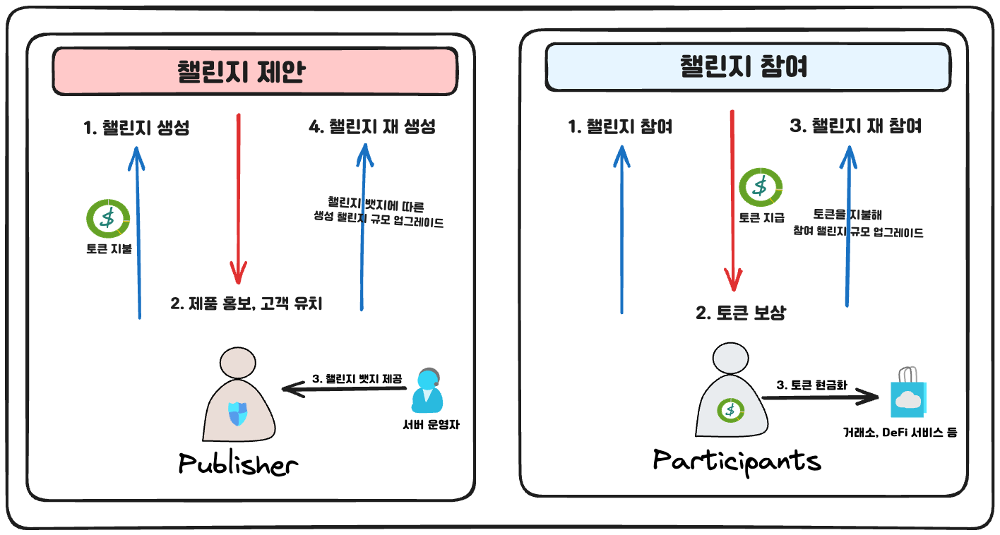
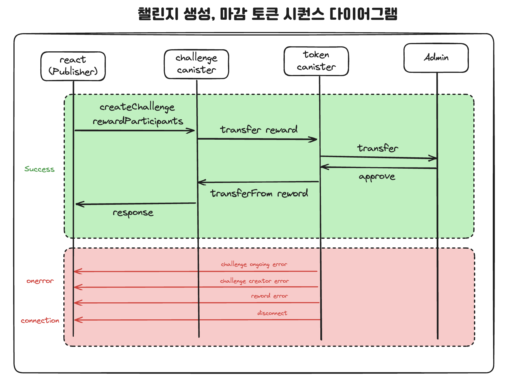

# 2023_ICP_hackathon

#### This project is a SNS challenge webpage created using `ICP canister`.

## 📖 Project Environment

-   reactJS v18.2.0
-   react-router-dom v6.17.0
-   typescript v5.2.2
-   dfx v0.15.0
-   azle v0.18.4
-   icp canister

## 🧰 Getting Started

Install azle, DFX and Replica Node in `back-end` and backend server.

```
// azle
npm install --g azle
brew install clang
brew install openssl@1.1
brew install pkg-config
npm install -g azle

// DFX
DFX_VERSION=0.14.2 sh -ci "$(curl -fsSL https://sdk.dfinity.org/install.sh)"
echo 'export PATH="$PATH:$HOEM/bin"' >> "$HOME/.bashrc"
dfx -V
npm install
npm run dfx_install

// Replica Node
npm run replica_start // 실제 명령 : dfx start --background
npm run replica_stop  // 실제 명령 : dfx stop

// Deploy canister
npm run canister_deploy_local // 실제 명령 : dfx deploy_world
```

```
$ dfx stop
$ dfx start —clean —background
$ dfx canister create —all
$ dfx identity whoami
$ dfx deploy challenge
$ dfx deploy token
$ process.sh
```

Install node modules in `front-end` and frontend server.

```
$ cd challenge
$ dfx generate
$ npm install
$ npm run start
```

## 🌟 About the Project

### Service Structure



-   주요 사용자는 챌린지를 제안하는 `Publisher`와 챌린지를 참여하는 `Participants`입니다.
-   `Publisher`는 토큰을 지불하여 챌린지를 생성하고, 사람들에게 챌린지를 노출시킵니다.
-   `Participants`는 챌린지에 참여 후 토큰을 보상받고, 해당 토큰을 통해 챌린지를 생성하거나, 재화로 사용할 수 있습니다.

### Architecture


-   `challenge`, `token` canister를 통해 서버를 구현하였습니다.
-   `challenge` canister 는 챌린지 생성, 참가, 보상 등이 구현되어 있습니다.
-   `token` canister 는 계정 생성 / 삭제, 토큰 전송 / 승인 / 발행 / 소각 기능이 구현되어 있습니다.

### Sequence Diagram

-   챌린지 생성, 마감 시퀀스 다이어그램
    

-   계정 생성, 삭제 시퀀스 다이어그램
    

### File Tree

```
📦challenge
 ┣ 📂src
 ┃ ┣ 📂canisters
 ┃ ┃ ┣ 📜challenge.ts
 ┃ ┃ ┣ 📜process.sh
 ┃ ┃ ┗ 📜token.ts
 ┃ ┣ 📂declarations
 ┃ ┃ ┗ 📂front
 ┃ ┃ ┃ ┣ 📜front.did
 ┃ ┃ ┃ ┣ 📜front.did.d.ts
 ┃ ┃ ┃ ┣ 📜front.did.js
 ┃ ┃ ┃ ┣ 📜index.d.ts
 ┃ ┃ ┃ ┗ 📜index.js
 ┃ ┣ 📂dids
 ┃ ┃ ┣ 📜challenge.did
 ┃ ┃ ┗ 📜token.did
 ┃ ┗ 📂front
 ┃ ┃ ┣ 📂build
 ┃ ┃ ┃ ┣ 📂images
 ┃ ┃ ┃ ┃ ┣ 📜date.png
 ┃ ┃ ┃ ┃ ┣ 📜dia.png
 ┃ ┃ ┃ ┃ ┣ 📜dia2.png
 ┃ ┃ ┃ ┃ ┣ 📜difinity.png
 ┃ ┃ ┃ ┃ ┣ 📜participate.jpg
 ┃ ┃ ┃ ┃ ┣ 📜participate.png
 ┃ ┃ ┃ ┃ ┣ 📜profile.png
 ┃ ┃ ┃ ┃ ┗ 📜wallet.png
 ┃ ┃ ┃ ┣ 📂static
 ┃ ┃ ┃ ┃ ┣ 📂css
 ┃ ┃ ┃ ┃ ┃ ┣ 📜main.1bd3a0bc.css
 ┃ ┃ ┃ ┃ ┃ ┗ 📜main.1bd3a0bc.css.map
 ┃ ┃ ┃ ┃ ┗ 📂js
 ┃ ┃ ┃ ┃ ┃ ┣ 📜main.516d38cb.js
 ┃ ┃ ┃ ┃ ┃ ┣ 📜main.516d38cb.js.LICENSE.txt
 ┃ ┃ ┃ ┃ ┃ ┗ 📜main.516d38cb.js.map
 ┃ ┃ ┃ ┣ 📜asset-manifest.json
 ┃ ┃ ┃ ┣ 📜favicon.ico
 ┃ ┃ ┃ ┣ 📜index.html
 ┃ ┃ ┃ ┣ 📜logo192.png
 ┃ ┃ ┃ ┣ 📜logo512.png
 ┃ ┃ ┃ ┣ 📜manifest.json
 ┃ ┃ ┃ ┗ 📜robots.txt
 ┃ ┃ ┣ 📂declarations
 ┃ ┃ ┃ ┣ 📂challenge
 ┃ ┃ ┃ ┃ ┣ 📜challenge.did
 ┃ ┃ ┃ ┃ ┣ 📜challenge.did.d.ts
 ┃ ┃ ┃ ┃ ┣ 📜challenge.did.js
 ┃ ┃ ┃ ┃ ┣ 📜index.d.ts
 ┃ ┃ ┃ ┃ ┗ 📜index.js
 ┃ ┃ ┃ ┗ 📂token
 ┃ ┃ ┃ ┃ ┣ 📜index.d.ts
 ┃ ┃ ┃ ┃ ┣ 📜index.js
 ┃ ┃ ┃ ┃ ┣ 📜token.did
 ┃ ┃ ┃ ┃ ┣ 📜token.did.d.ts
 ┃ ┃ ┃ ┃ ┗ 📜token.did.js
 ┃ ┃ ┣ 📂public
 ┃ ┃ ┃ ┣ 📂images
 ┃ ┃ ┃ ┃ ┣ 📜date.png
 ┃ ┃ ┃ ┃ ┣ 📜dia.png
 ┃ ┃ ┃ ┃ ┣ 📜dia2.png
 ┃ ┃ ┃ ┃ ┣ 📜difinity.png
 ┃ ┃ ┃ ┃ ┣ 📜participate.jpg
 ┃ ┃ ┃ ┃ ┣ 📜participate.png
 ┃ ┃ ┃ ┃ ┣ 📜profile.png
 ┃ ┃ ┃ ┃ ┗ 📜wallet.png
 ┃ ┃ ┃ ┣ 📜favicon.ico
 ┃ ┃ ┃ ┣ 📜index.html
 ┃ ┃ ┃ ┣ 📜logo192.png
 ┃ ┃ ┃ ┣ 📜logo512.png
 ┃ ┃ ┃ ┣ 📜manifest.json
 ┃ ┃ ┃ ┗ 📜robots.txt
 ┃ ┃ ┣ 📂src
 ┃ ┃ ┃ ┣ 📂Components
 ┃ ┃ ┃ ┃ ┣ 📂modal
 ┃ ┃ ┃ ┃ ┃ ┣ 📜ParticipateModal.jsx
 ┃ ┃ ┃ ┃ ┃ ┗ 📜SuggestModal.jsx
 ┃ ┃ ┃ ┃ ┣ 📜Footer.jsx
 ┃ ┃ ┃ ┃ ┣ 📜Header.jsx
 ┃ ┃ ┃ ┃ ┣ 📜Home.jsx
 ┃ ┃ ┃ ┃ ┣ 📜Profile.jsx
 ┃ ┃ ┃ ┃ ┗ 📜Suggest.jsx
 ┃ ┃ ┃ ┣ 📂declarations
 ┃ ┃ ┃ ┃ ┣ 📂challenge
 ┃ ┃ ┃ ┃ ┃ ┣ 📜challenge.did
 ┃ ┃ ┃ ┃ ┃ ┣ 📜challenge.did.d.ts
 ┃ ┃ ┃ ┃ ┃ ┣ 📜challenge.did.js
 ┃ ┃ ┃ ┃ ┃ ┣ 📜index.d.ts
 ┃ ┃ ┃ ┃ ┃ ┗ 📜index.js
 ┃ ┃ ┃ ┃ ┗ 📂token
 ┃ ┃ ┃ ┃ ┃ ┣ 📜index.d.ts
 ┃ ┃ ┃ ┃ ┃ ┣ 📜index.js
 ┃ ┃ ┃ ┃ ┃ ┣ 📜token.did
 ┃ ┃ ┃ ┃ ┃ ┣ 📜token.did.d.ts
 ┃ ┃ ┃ ┃ ┃ ┗ 📜token.did.js
 ┃ ┃ ┃ ┣ 📂fonts
 ┃ ┃ ┃ ┃ ┗ 📜Orbit-Regular.ttf
 ┃ ┃ ┃ ┣ 📂modules
 ┃ ┃ ┃ ┃ ┣ 📜canisters.js
 ┃ ┃ ┃ ┃ ┣ 📜client.js
 ┃ ┃ ┃ ┃ ┣ 📜modules.js
 ┃ ┃ ┃ ┃ ┗ 📜wallet.js
 ┃ ┃ ┃ ┣ 📜App.css
 ┃ ┃ ┃ ┣ 📜App.js
 ┃ ┃ ┃ ┗ 📜index.jsx
 ┃ ┃ ┣ 📜README.md
 ┃ ┃ ┣ 📜index.html
 ┃ ┃ ┣ 📜package-lock.json
 ┃ ┃ ┣ 📜package.json
 ┃ ┃ ┗ 📜webpack.config.js
 ┣ 📜.gitignore
 ┣ 📜README.md
 ┣ 📜dfx.json
 ┣ 📜package-lock.json
 ┣ 📜package.json
 ┗ 📜tsconfig.json
```
